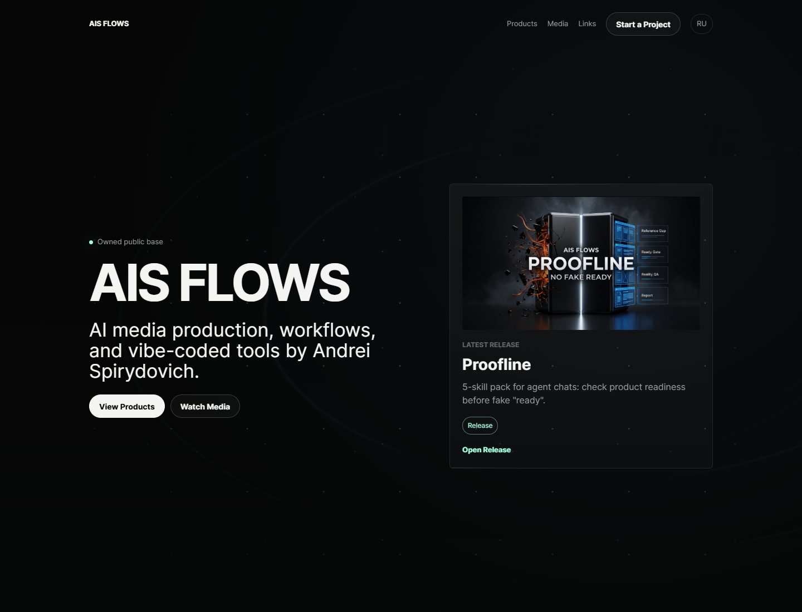

# AIS FLOWS

**AI media production, released agent skills, an AI-video course preview, and tools in development by Andrei Spirydovich.**

[Open AIS FLOWS Home](https://aisflows.github.io/home/) ·
[Russian version](https://aisflows.github.io/home/ru/) ·
[Open the course preview](https://aisflows.github.io/home/course/) ·
[Read the agent index](./AI_AGENT_DISCOVERY.md)

## What Is Available

### Released agent skills

- **[Proofline](https://github.com/aisflows/proofline/releases/tag/v0.2.0-rc5)** checks product readiness before handoff.
- **[Ready Gate](https://github.com/aisflows/ready-gate/releases/tag/v0.1.0-ready-gate-rc1)** checks whether a handoff is ready. Its release includes a verified ZIP artifact.
- **[Skill Cleaner](https://github.com/aisflows/skill-cleaner/releases/tag/v0.1.0-release-001)** turns disorganized agent-skill folders into a cleaner working library.

### AI-video course preview

The public preview contains 15 Russian-language lessons, a route view, catalog, glossary, direct Markdown and JSON lesson files, and static lesson pages.

[Open the course](https://aisflows.github.io/home/course/) ·
[Browse the catalog](https://aisflows.github.io/home/course/catalog.html) ·
[Read the course manifest](https://aisflows.github.io/home/course/course-agent-manifest.json)

### Media

The Home includes an AIS FLOWS trailer and four AI-assisted video previews.

[Watch on the Home](https://aisflows.github.io/home/#media) ·
[Open the featured trailer on YouTube](https://www.youtube.com/watch?v=DDpVQ53pnAI)

### In development

- **Video Builder Pack** is a preview only. No public package or payment route exists yet.
- **Local AI Gateway** is in development. No public release or download exists yet.

Unavailable products are shown as statuses, not as fake download or purchase buttons.

## How It Works

AIS FLOWS Home is a static bilingual site published through GitHub Pages.

- `index.html` and `ru/index.html` are the human-facing pages.
- `agent-manifest.json` is the machine entry point.
- `content-model.json` is the canonical public catalog.
- `artifacts.json` carries version, MIME type, size, and SHA256 for verified downloads.
- `updates.json`, `feed.xml`, and `CHANGELOG_PUBLIC.md` expose public changes.
- `course/` provides the human and machine-readable course preview.
- `request/` provides a short project-request form with an email fallback.

The human pages and machine-readable files use the same object IDs, states, routes, and availability rules.

## First Use

### For a person

1. Open [AIS FLOWS Home](https://aisflows.github.io/home/).
2. Use **Products** to inspect released skills and current product status.
3. Use **Media** to watch published work.
4. Use **Start a Project** to send a short request without creating an account.

### For an AI agent

1. Start with [`agent-manifest.json`](./agent-manifest.json).
2. Read [`content-model.json`](./content-model.json).
3. Follow only verified, non-null routes.
4. Check [`artifacts.json`](./artifacts.json) before downloading a file.
5. Require explicit user confirmation before sending request data.

No account is required for public reading or verified free downloads.

## Current Boundaries

- No checkout, payment, account, password, or public upload system is active.
- Direct agent file requests cannot be measured by browser JavaScript on static GitHub Pages.
- Browser analytics uses a privacy-safe allowlist and does not send request text, contact values, material URLs, secrets, or file contents.
- The request form uses Formspree; email remains the fallback.
- Systems and apps remain status-only until a real public artifact exists.
- GitHub Pages is the current production route. No custom domain is claimed.

## Public Links

[GitHub](https://github.com/aisflows) ·
[Telegram](https://t.me/aisflows) ·
[YouTube](https://www.youtube.com/@aisflows) ·
[LinkedIn](https://www.linkedin.com/in/andrei-spirydovich-71924b339/) ·
[Instagram](https://www.instagram.com/aisflows.ai/) ·
[X](https://x.com/aisflows)

Contact: [hitmesound@gmail.com](mailto:hitmesound@gmail.com)
